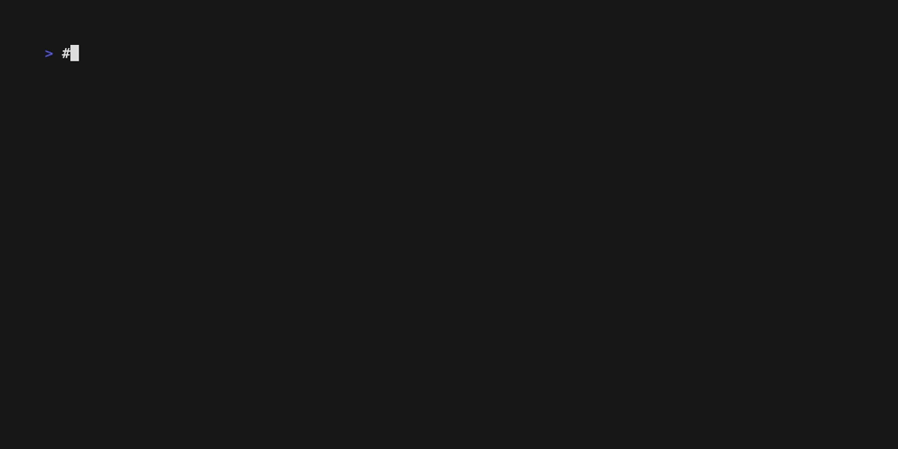

# Verifier



Verifier is a powerful CLI tool designed to validate Kubernetes configurations, Helm charts, and live clusters against security best practices and custom policies. It helps developers and platform engineers catch misconfigurations early, ensuring compliance and stability before deployment.

## Key Features

- **Multi-Source Verification**: Analyze local Helm charts, raw YAML manifests, or live Kubernetes namespaces.
- **Drift Detection**: Compare current findings against a baseline to detect new issues or regressions.
- **Actionable Insights**: Get detailed reports with fix suggestions (`--fix`) to resolve issues quickly.
- **Exposure Analysis**: Identify potential security exposure risks in your workloads.
- **CI/CD Ready**: Output results in multiple formats (Table, JSON, SARIF, HTML, Markdown) for easy integration.

## Why Verifier?

Unlike standard linters, Verifier offers a comprehensive workflow that bridges the gap between static analysis and live cluster state. It doesn't just check syntax; it validates security posture, resource limits, and best practices with a built-in policy engine.

## Sample Report


## Quick Start

### Verify a Helm Chart
```bash
verifier --chart ./my-chart --release my-app -n default
```

### Verify a Manifest
```bash
verifier --manifest ./deployment.yaml
```

### Verify a Live Namespace
```bash
verifier --namespace default
```

### Generate a Fix Plan
```bash
verifier --manifest ./deployment.yaml --fix
```

### Compare Against Baseline
```bash
# Generate baseline
verifier --manifest ./deployment.yaml --baseline baseline.json

# Check for regressions
verifier --manifest ./deployment.yaml --compare-to baseline.json
```
